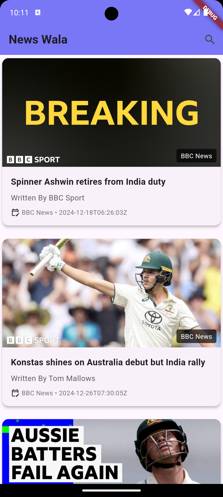
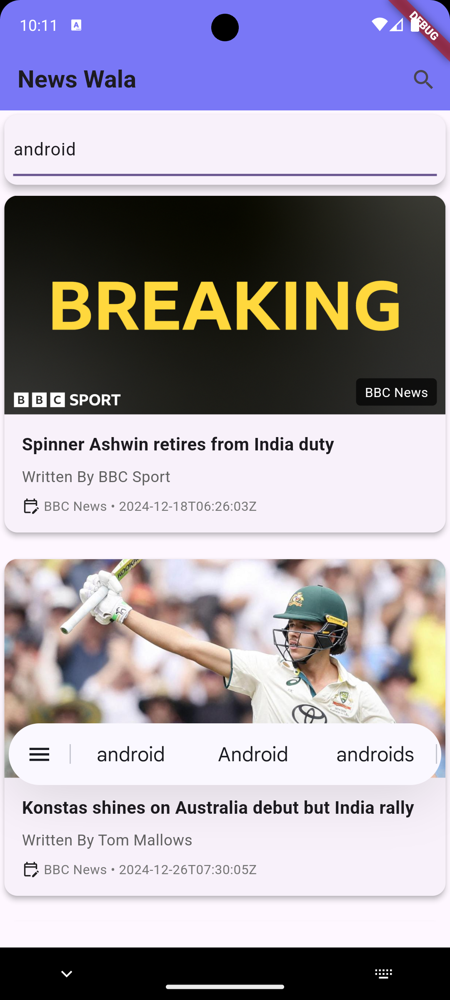
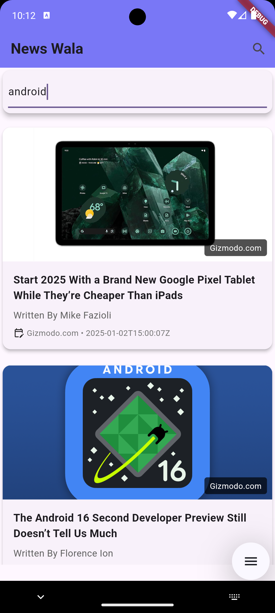

<p align="center">
  

  <h1 align="center">News Wala</h1>

  <h4 align="center">See It In Action <a href="https://sheikhasif-ali.github.io/#newsWala">Here!</a></h4>

<div style="display: flex; justify-content: center;">
   
    
     
  
</div>


  <p align="center">
    A News App using dio and NEWS API
    <br>
    Project made with much  :heart: <br> Contains API Requests, cool UI/UX, and much more!
    <br>
    <br>
    <a href="https://github.com/sheikhasif-ali/news_wala/issues">Report bug</a>
    ·
    <a href="https://github.com/sheikhasif-ali/news_wala/issues">Request feature</a>
  </p>
</p>

## Table of contents

- [Quick start](#quick-start)
- [What's included](#whats-included)
- [Bugs and feature requests](#bugs-and-feature-requests)
- [Creators](#creator)
- [Copyright and license](#copyright-and-license)

## Quick start

This is a normal flutter app. You should follow the instructions in the [official documentation](https://flutter.io/docs/get-started/install).
## Run Locally

<b>Clone the project</b>

```bash
  https://github.com/sheikhasif-ali/news_wala.git
```

<b>Go to the project directory</b>

```bash
  cd news_wala
```

<b>Install dependencies</b>

```bash
  flutter pub get
```

<b>Add API Key</b>

Go to <a href="https://newsapi.org/">News API</a> and get an API Key. Then open the api_key.dart file

```bash
  cd news_wala/lib/api/api_key.dart
```

and add your API Key to the apiKey field.
```dart
class ApiKey {
  //enter your api key here
  final String apiKey = '';
}
```
<br>


<b>Run the project</b>

```bash
  flutter run
```

## What's included

* Material Esque Theme
* Search bar, to search for specific stories
* Responsive layout


## Bugs and feature requests

Have a bug or a feature request? [please open a new issue](https://github.com/sheikhasif-ali/news_wala/issues).

## Creator

**Sheikh Asif Ali**

- <https://github.com/sheikhasif-ali>


## Copyright and license

Code and documentation copyright 2025 the authors. Cannot be reused without prior permission.

Enjoy :metal:
